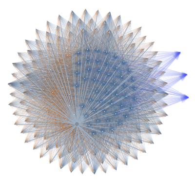

# linqinfer

[](https://travis-ci.org/roberino/linqinfer)

Nuget Package: https://www.nuget.org/packages/LinqInfer/


## A lightweight inference library for C# / LINQ

LinqInfer is a data transformation, learning and inference framework. 

This library reflects my interest over the years in Bayesian probability, 
probabilistic reasoning, classification and other means of inference.

### Some key features / aims of the library

* Data extraction methods for object and text based data sets for converting into vector representations
* Methods for transforming and processing vector models
* Implementations of learning algorithms
* An extensible framework for integrating other vector based algorithms

### Basic library layout 

#### Features and Feature Pipelines

Feature extraction is key to many of the classification algorithms.

Feature pipelines represent a pipeline of feature data which can be 
transformed and pumped into various forms. There are a few mechanisms
for reducing the dimensionality of the input data, such as principle component 
analysis.

When data is extracted, it is represented as an enumeration of column vectors which 
can be transformed and filtered before being consumed for classifier training.

Feature pipelines come in [asynchronous](docs/async-pipelines.md) and synchronous flavours. 

Async pipelines support a more complex, batch orientated processing model
which allows for parallel processing of data. Create asyncronous enumerators
using the Data.Pipes namespace. You can create from simple enumerators
or from loading functions.

Synchronous pipelines are derived from IQueryable data sets.

#### Learning

This is a collection of machine learning algorithms which are available through extention 
functions and operate on IQueryable sets of data or on asyncronous enumerators.

* Self organising feature maps
* Simple statistical classifier
* Multi-layer neural network classifier

##### Example

```cs

var cancel = new CancellationTokenSource();

// MyDataLoader returns an enumeration of data
// There are various other ways to create 
// an async enumerator

var data = MyDataLoader().AsAsyncEnumerator();

// Apply transformations and create a set for training
// You need to supply an expression which can classify your data
// for training 

var trainingSet = await data
    .BuildPipelineAsync(cancel.Token)
    .CentreAndScaleAsync(Range.ZeroToOne)
    .AsTrainingSetAsync(x => x.classification, cancel.Token);

// Attach a network model to the training set
// You can attach numerous models and train them in parallel

var classifier = trainingSet.AttachMultilayerNetworkClassifier(b =>
{
    b.ConfigureSoftmaxNetwork(4, p =>
    {
        p.LearningRate = 0.005;
    });
});

// Run the training procedure (over 550 epochs)

await trainingSet.RunAsync(cancel.Token, 550);

// Test the classifier

var results = classifier.Classify(new
{
    x = 10,
    y = 10,
    classification = "?"
});

// Export the classifier

var exportedNetwork = classifier.ExportData();

```

See also [character learning example] (tests/LinqInfer.ImageLearningTests/ImageLearningExamples.cs)

See more documentation on [Neural Networks](docs/neural-networks.md)

#### Text

Utilities for working with text and text documents.

```cs

var index = docs // enumeration of XDocuments
	.AsTokenisedDocuments(d => d.Root.Name.LocalName) // Use the root element name as the doc ID
	.CreateIndex();

var results = index.Search("brown fox");

// create training sets

var httpServices = new HttpDocumentServices();

var documentSource = httpServices.CreateDocumentSource(uri);

var corpus = await documentSource.CreateCorpusAsync(1000);

var trainingSet = corpus.CreateContinuousBagOfWordsAsyncTrainingSet(index.ExtractKeyTerms(500));

```
See more documentation on [Text](docs/text.md)

#### Maths

The Maths namespace consists of some basic numerical utilities 
including numerous forms of vectors and vector manipulation methods.

#### Maths.Graphs

The Maths.Graphs namespace contains useful objects and functions for creating graphical representations of structures.

Graphs can be exported into [GEXF](https://gephi.org/gexf/format/schema.html).

Check out [Sigmajs](http://sigmajs.org/) and [Gephi](https://gephi.org/) for visualising graphs.




#### Maths.Probability 

This is a collection of functions and probability "objects" to help solve simple probability problems.

* Sample spaces
* Hypotheses
* Markov chains
* Monte Carlo simulations

##### Examples

```cs

// Sample space

var sampleSpace = queryableSampleDataset.AsSampleSpace();

var p = sampleSpace.ProbabilityOfEvent(p => p.Age > 25);

// Hypotheses

var die = new[] { 4, 6, 8, 12, 20 };
var hypos = die.Select(n => P.Of(n).Is(1).OutOf(die.Length)).AsHypotheses();

hypos.Update(x => x < 6 ? Fraction.Zero : (1).OutOf(x));

hypos.ProbabilityOf(4);

```

#### Data

Serialisation and data storage interfaces.

### Examples

See tests for more usage examples.

It is still a work in progress.
