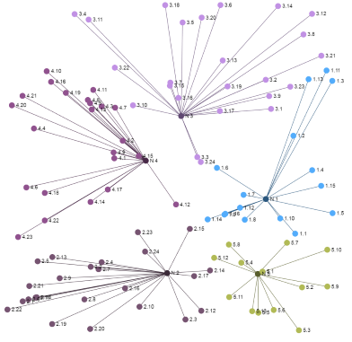

# linqinfer

[](https://travis-ci.org/roberino/linqinfer)

Nuget Package: https://www.nuget.org/packages/LinqInfer/

## A lightweight inference library for C# / LINQ

This library reflects my interest over the years in Bayesian probability, 
probabilistic reasoning, classification and other means of inference.

It is an attempt to create a useful library which uses a fluent and LINQ-like approach to this type of problem solving.

### Basic library layout

#### Features and Feature Pipelines

Feature extraction is key to many of the classification algorithms and feature pipelines
represent a pipeline of feature data which can be pumped into various forms. There are a few mechanisms
for reducing the dimensionality of the input data, such as principle component analysis and custom transformations.

When data is extracted, it is represented as an enumeration of column vectors which 
can be transformed and filtered before being consumed for classifier training.



#### Learning

This is a collection of machine learning algorithms which are available through extention 
functions and operate on IQueryable sets of data.

* Self organising feature maps
* Simple statistical classifier
* Multi-layer neural network classifier

##### Examples

```cs

var pipeline = queryableSampleDataset.CreatePipeline();

// Self Organising Feature Map

var featureMap = = pipeline.ToSofm().Execute();

// Naive Bayes Classifier

var classifier1 = pipeline.ToNaiveBayesClassifier(p => p.ClassificationGroup).Execute();

// Multi-layer Neural Network Classifier

var classifier2 = pipeline.ToMultilayerNetworkClassifier(p => p.ClassificationGroup, 0.3f).Execute();

// or create a training set first

var trainingSet = pipeline.AsTrainingSet(p => p.ClassificationGroup);
var classifier3 = trainingSet.ToMultilayerNetworkClassifier().Execute();

```

See more documentation on [Neural Networks](docs/neural-networks.md)

#### Maths

The Maths namespace consists of some basic numerical utilities including vector manipulation classes 
and fractions which can sometimes offer a nicer way of working with probabilities.

#### Maths.Graphs

The Maths.Graphs namespace contains useful objects and functions for creating graphical representations of structures. 

Graphs can be exported into [GEFX](https://gephi.org/gexf/format/schema.html).

Check out [Sigmajs](http://sigmajs.org/) and [Gephi](https://gephi.org/) for visualising graphs.

#### Maths.Probability 

This is a collection of functions and probability "objects" to help solve simple probability problems.

* Sample spaces
* Hypotheses
* Markov chains
* Monte Carlo simulations

##### Examples

```cs

// Sample space

var sampleSpace = queryableSampleDataset.AsSampleSpace();

var p = sampleSpace.ProbabilityOfEvent(p => p.Age > 25);

// Hypotheses

var die = new[] { 4, 6, 8, 12, 20 };
var hypos = die.Select(n => P.Of(n).Is(1).OutOf(die.Length)).AsHypotheses();

hypos.Update(x => x < 6 ? Fraction.Zero : (1).OutOf(x));

hypos.ProbabilityOf(4);

```

#### Text

Utilities for working with text and text documents.

```cs

var index = docs // enumeration of XDocuments
	.AsTokenisedDocuments(d => d.Root.Name.LocalName) // Use the root element name as the doc ID
	.CreateIndex();

var results = index.Search("brown fox");

// create feature pipelines

var data = GetTextualObjects();

var pipeline = data.CreateTextFeaturePipeline(a => a.cls, vectorSize);

```

#### Data

Serialisation and data storage interfaces.

### Examples

See tests for more usage examples.

It is still a work in progress.